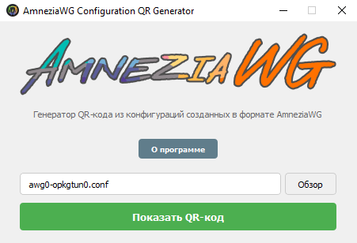
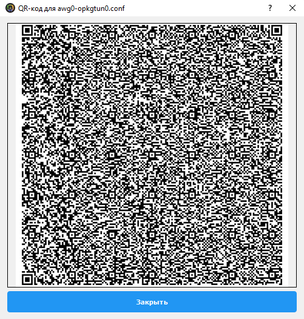
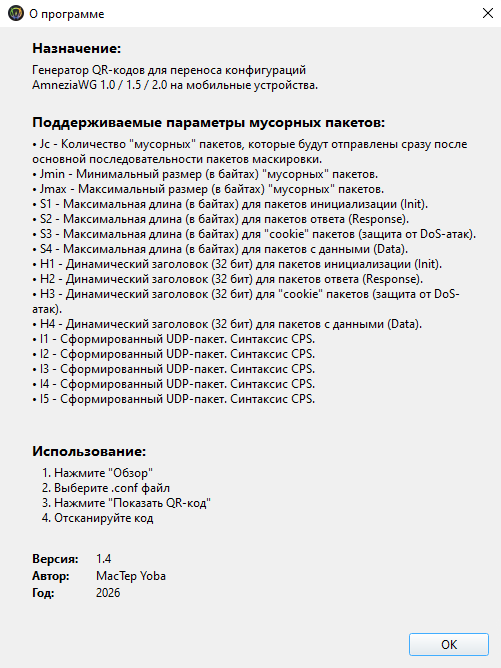

# AmneziaWG Configuration QR Generator
Простая программа для генерации QR-кодов из конфигурационных файлов AmneziaWG. Позволяет легко перенести настройки VPN на мобильные устройства путем сканирования кода. Поддерживает все параметры "мусорных" пакетов AmneziaWG 1.0 / 1.5 / 2.0.

<div align="center">
  
  <p><i>Генератор QR-кодов для конфигураций AmneziaWG</i></p>
</div>

## 📋 О программе

**AmneziaWG Configuration QR Generator** — это десктопное приложение с графическим интерфейсом, созданное для упрощения переноса конфигураций AmneziaWG на мобильные устройства. Программа читает файл конфигурации (.conf) и генерирует QR-код, который можно отсканировать в приложении AmneziaWG на телефоне.

Поддерживаются все специфические параметры AmneziaWG, включая настройки "мусорных" пакетов (Jc, Jmin, Jmax) и динамические заголовки.

## ✨ Возможности

- **Простой интерфейс** — интуитивно понятное окно с кнопкой выбора файла и генерации QR-кода
- **Поддержка всех параметров AmneziaWG**:
  - `Jc`, `Jmin`, `Jmax` — настройки мусорных пакетов
  - `S1`, `S2`, `S3`, `S4` — максимальные длины пакетов
  - `H1`, `H2`, `H3`, `H4` — динамические заголовки
  - `I1`, `I2`, `I3`, `I4`, `I5` — сформированные UDP-пакеты (синтаксис CPS)
- **Предпросмотр** — QR-код отображается в отдельном окне с возможностью масштабирования
- **Информация о программе** — подробное описание всех параметров и инструкция по использованию

## 📸 Скриншоты

<div align="center">
  
  
  
</div>


## 🚀 Установка и запуск

### Предварительные требования

- Python 3.6 или выше
- pip (менеджер пакетов Python)

### Установка зависимостей

```bash
pip install PyQt5 qrcode[pil]
